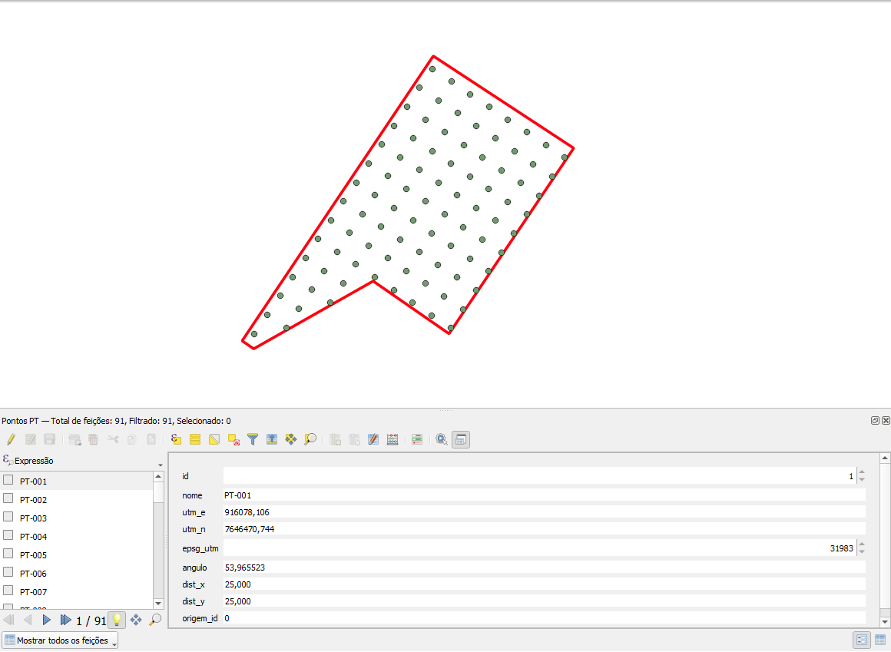

# PT Maker QGIS

Script de Processing para QGIS que gera uma camada de pontos dentro de um poligono, com grade alinhada a uma aresta do contorno e atributos prontos para uso em campo.

## O que o script faz

- Gera pontos internos em grade regular.
- Permite espacamento padrao `25 x 25`, `50 x 50` ou personalizado.
- Alinha a grade por:
  - modo automatico;
  - maior lado do poligono;
  - angulo manual.
- Ajusta o deslocamento da grade para melhorar a ocupacao interna do poligono.
- Permite definir margem interna para afastar os pontos da borda.
- Cria nomes sequenciais no formato `PT-001`, `PT-002`, `PT-003`...
- Grava coordenadas UTM SIRGAS 2000 na tabela de atributos.

## Arquivo principal

- `gerar_pontos_pt_qgis.py`

## Requisitos

- QGIS 3.x com framework de Processing habilitado.
- Camada de entrada do tipo poligono.

## Instalacao no QGIS

1. Abra `Processamento > Caixa de Ferramentas`.
2. Expanda `Scripts`.
3. Clique em `Adicionar script existente`.
4. Selecione o arquivo `gerar_pontos_pt_qgis.py`.
5. Execute o algoritmo `PT Maker > Gerar pontos PT alinhados em poligono`.

## Parametros

- `Camada de poligono`: camada de entrada.
- `Espacamento padrao`: `25 x 25`, `50 x 50` ou `Personalizado`.
- `Distancia X` e `Distancia Y`: usados no modo personalizado.
- `Modo de alinhamento`:
  - `Automatico (maior lado quase ortogonal)`;
  - `Maior lado do poligono`;
  - `Angulo manual`.
- `Angulo manual (graus)`: usado quando o modo manual for escolhido.
- `Tolerancia para canto perto de 90 graus`: ajuda o modo automatico a escolher uma aresta coerente.
- `Margem interna da borda (metros)`: afasta os pontos do limite do poligono.

## Campos de saida

- `id`: sequencial numerico.
- `nome`: nome do ponto no formato `PT-001`.
- `utm_e`: coordenada UTM Leste.
- `utm_n`: coordenada UTM Norte.
- `epsg_utm`: EPSG UTM SIRGAS 2000 usado na saida.
- `angulo`: angulo final usado para alinhar a grade.
- `dist_x`: espacamento em X.
- `dist_y`: espacamento em Y.
- `origem_id`: id da feicao de origem.

## Observacoes

- A camada de saida e criada em UTM SIRGAS 2000, escolhida pelo centroide do primeiro poligono.
- O modo automatico tenta equilibrar:
  - fidelidade ao lado principal;
  - melhor preenchimento da area;
  - menor sobra nas bordas.
- Em geometrias muito irregulares, uma grade unica nunca vai encaixar perfeitamente em todas as bordas ao mesmo tempo. Nesses casos, use:
  - `Margem interna da borda`;
  - `Maior lado do poligono`;
  - `Angulo manual`.

## Uso recomendado

- Para areas mais regulares, comecar com `Automatico`.
- Para areas alongadas ou com orientacao bem clara, testar `Maior lado do poligono`.
- Para padrao de projeto ja definido, usar `Angulo manual`.
- Se os pontos ficarem muito perto da borda, aumentar a `Margem interna da borda`.

## Estrutura do repositorio

- `README.md`
- `LICENSE`
- `gerar_pontos_pt_qgis.py`

## Licenca

Este projeto esta licenciado sob a licenca MIT.
